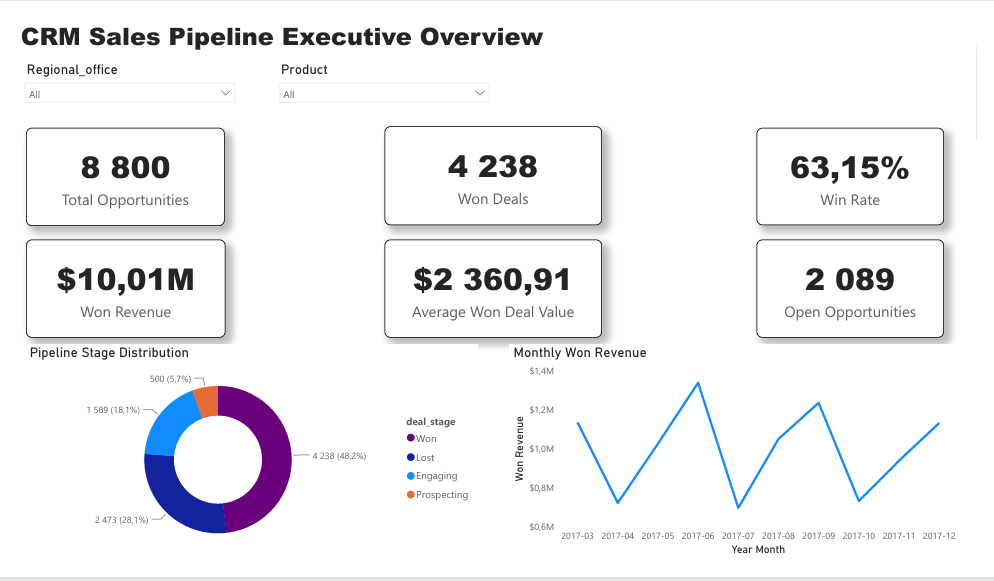
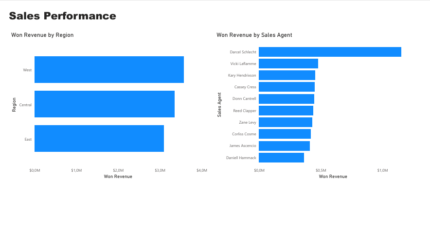
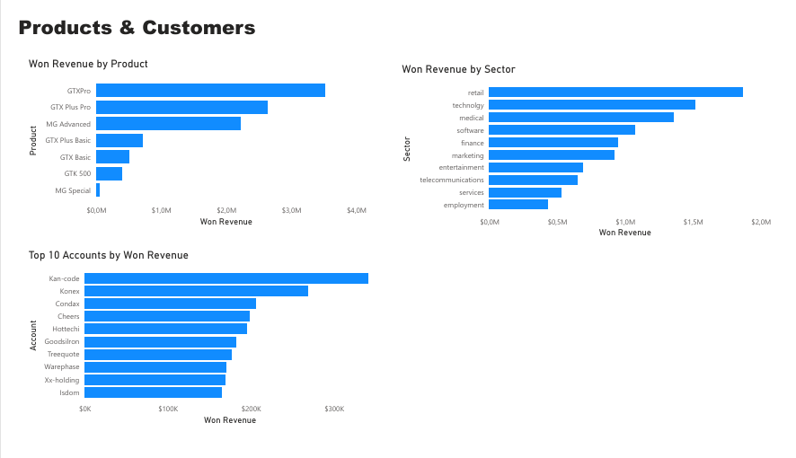
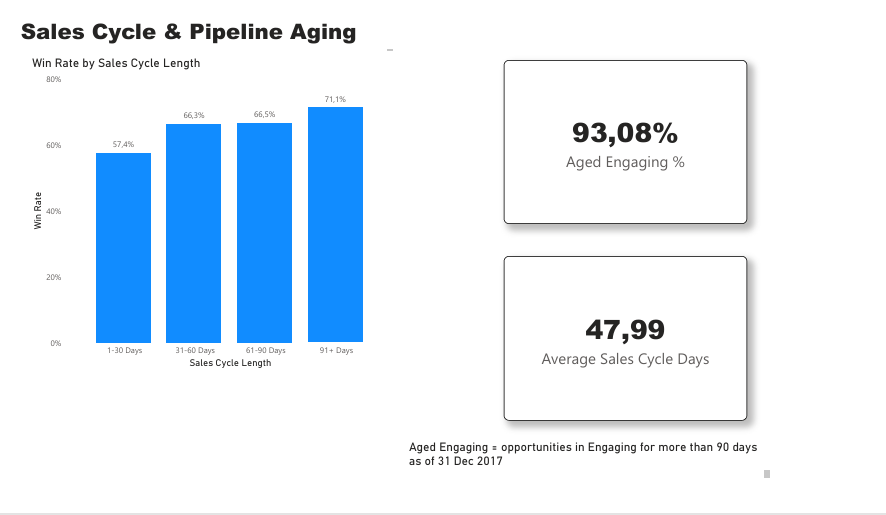

# CRM Sales Pipeline Analysis — SQL Server & Power BI Business Analytics Project

## Project Overview

End-to-end CRM sales pipeline analytics project using Microsoft SQL Server, T-SQL, and Power BI. It transforms raw CRM data into a structured, cleaned, and validated model, analyzes sales, products, customers, teams, and sales-cycle performance, and presents key insights in an interactive dashboard.

## Business Problem

The business lacked a consolidated view of CRM sales performance across opportunities, products, customers, sales teams, and sales-cycle activity. The project was designed to structure the CRM data, improve data quality, and identify patterns in revenue, conversion, pipeline aging, and sales performance to support better decision-making.

## Project Objectives

The project objectives were to build a reliable SQL Server database from raw CRM files, clean and validate the data, analyze sales and pipeline performance with T-SQL, identify meaningful business patterns, optimize key queries, and present the final insights through an interactive Power BI dashboard.

## Dataset

The project uses four CRM source files containing account, product, sales-team, and sales-pipeline data. Together, they cover 85 customer accounts, 7 products, 35 sales agents, and 8,800 sales opportunities.

The data includes:

- Deal stages
- Engagement and close dates
- Deal values
- Product pricing
- Account characteristics
- Sales agents and managers
- Regional sales-team information

## Tools & Technologies

- Microsoft SQL Server 2025
- SQL Server Management Studio (SSMS)
- T-SQL
- Power BI Desktop
- Power Query
- DAX
- CSV source files
- Git
- GitHub

## SQL Skills Demonstrated

- Database and schema creation
- Table design
- Primary and foreign keys
- CSV data import
- Data profiling
- NULL and duplicate checks
- Data cleaning
- Type conversion
- JOINs
- CASE expressions
- Aggregate functions
- Date functions
- Common Table Expressions (CTEs)
- Subqueries
- Window functions
- Views
- Stored procedures
- Indexing
- Execution-plan analysis
- Query optimization

## Power BI Skills Demonstrated

- SQL Server connectivity
- Power Query data validation
- Data modeling
- Date table creation
- Relationships
- DAX measures
- Calculated columns
- KPI cards
- Slicers
- Line charts
- Bar charts
- Column charts
- Donut charts
- Top N filtering
- Custom sorting
- Multi-page dashboard design

## Methodology

The project followed an end-to-end analytics workflow:

1. Planned the business questions and analytical objectives.
2. Created a SQL Server database and schemas.
3. Imported the raw CRM files into staging tables.
4. Profiled the source data for missing values, duplicates, invalid values, and relationship issues.
5. Cleaned and transformed the data while preserving the raw source layer.
6. Built a validated relational CRM model.
7. Performed business analysis using T-SQL.
8. Created reusable views and stored procedures.
9. Validated calculations and relationships.
10. Analyzed query performance and implemented indexing.
11. Connected Power BI to the cleaned SQL model.
12. Built an interactive multi-page business dashboard.

## Key SQL Analysis

Key SQL work included:

- Pipeline KPI calculations
- Monthly and quarterly revenue analysis
- Sales-agent and regional performance comparisons
- Product and sector revenue analysis
- Customer concentration analysis
- Sales-cycle segmentation
- Pipeline-aging analysis

The project also used CTEs, window functions, views, a stored procedure, indexing, and execution-plan analysis to improve reusability and query performance.

## Power BI Dashboard

The final report contains four pages:

### Executive Overview

Pipeline KPIs, won revenue, win rate, open opportunities, pipeline-stage distribution, and monthly revenue trends.

### Sales Performance

Regional revenue and Top 10 sales-agent performance.

### Products & Customers

Product revenue, sector revenue, and Top 10 customer accounts.

### Sales Cycle & Pipeline Aging

Average sales-cycle duration, win rate by cycle length, and aged Engaging opportunities.

## Key Findings

- **Pipeline performance:** 8,800 opportunities produced 4,238 wins and 2,473 losses, resulting in a **63.15% closed-deal win rate** and approximately **$10.01M in won revenue**.
- **Product concentration:** GTX Pro, GTX Plus Pro, and MG Advanced generated **83.52% of total won revenue**.
- **Regional performance:** West generated the highest won revenue at approximately **$3.57M**, Central handled the greatest opportunity volume, and East achieved the highest average won deal value.
- **Customer performance:** Higher-revenue customer companies generated greater opportunity volume and total sales, while the Top 10 accounts represented only **20.72% of total won revenue**.
- **Sales cycle:** Completed opportunities averaged approximately **47.99 days** from engagement to close. Longer cycle groups showed higher historical win rates, although this represents association rather than causation.
- **Pipeline aging:** **93.08% of Engaging opportunities** had remained open for more than 90 days as of **31 December 2017**, highlighting a significant aged pipeline requiring review.

### Dashboard Preview

#### Executive Overview

#### Sales Performance

#### Products & Customers

#### Sales Cycle & Pipeline Aging

## Challenges & Solutions

Challenges included non-standard CSV delimiters, carriage-return characters introduced during import, one product-name mismatch caused by inconsistent spacing, and stage-dependent missing values in the sales pipeline.

These issues were diagnosed through data profiling and resolved using controlled T-SQL cleaning logic while preserving the original raw data in staging tables.

## Conclusion

This project demonstrates an end-to-end analytics workflow using SQL Server, T-SQL, and Power BI. Raw CRM data was transformed into a reliable analytical model, validated through structured quality checks, analyzed for sales and pipeline performance, and presented through an interactive dashboard.

The final solution highlights practical skills in database design, SQL analysis, data cleaning, performance optimization, DAX, and business reporting.